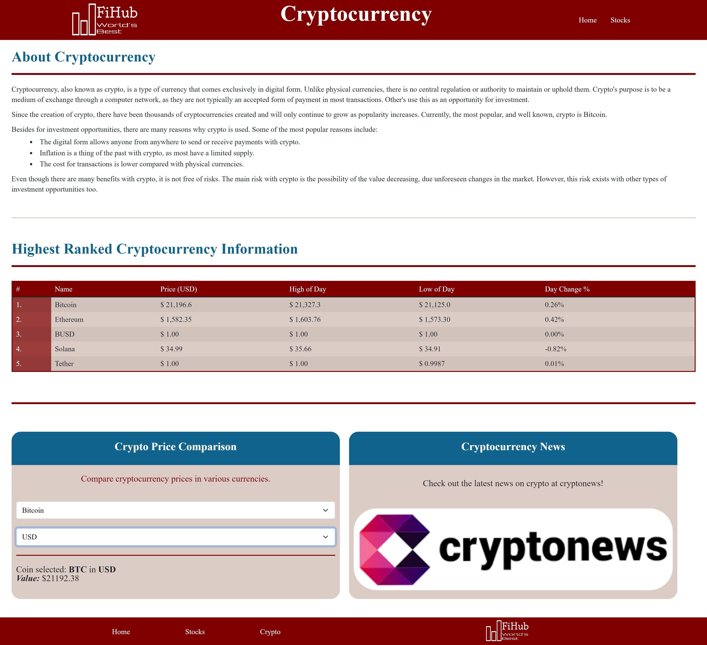

# FiHub - Finance Aggregator

DU Coding Boot Camp: Project 1

---

## Description

FiHub was created with the idea to use some of the top API's to provide valuable information, primarily for stocks and cryptocurrencies, for interested users. The FiHub project challenged all of its collaborators by applying new skills in HTML, CSS, JavaScript, and much more. Additionally, this was a learning opportunity for creating applications in a group setting, using GitHub, with the main focus of working in different branches.

The work involved for this project was split into two main categories based on application content: Cryptocurrency and Stocks. Within these two categories, the collaborators chose to mostly focus on either CSS style/static HTML content, DOM manipulation with JS, or JS API calls. The remainder of the application work was divided to whomever was able to take on the additional work. Collaborators also assisted each other with their chosen work as needed.

## Table of Contents

- [Goals](###goals)
- [Skills Learned/ Improved](###skills-learned-/-improved)
- [Installation](##installation)
- [Usage](#usage)
- [Goals](###goals)
- [Credits](##credits)

## FiHub Expectations

### Goals

A list of some of the goals for the FihHub project:

Application Goals:

- Create FiHub with an informative, clean, and polished UI.
- Use a minimum of two server-side API's.
- Store persistent user input data in client-side storage.
- Create a high quality repository that follows the coding industry standards.

Personal Goals:

- Use GitHub to work as a group.
- Work in GitHub with multiple branches and avoid any merge conflicts.
- Apply newly learned coding skills.
- Bringing a fun and interesting idea into a real-world application.

### Skills Learned / Improved

A list of skills that were learned and/or improved by the project's collaborators:

- HTML & CSS
- Bootstrap
- JavaScript & jQuery
- Server-side API's
- GitHub navigation

Tools used:

- VS Code
- Chrome Dev tools
- GitHub

## Installation

1. Navigate to the code repository
2. Press the green code button, located near the about section
3. Copy either the HTTPS, Git CLI, download the zip, open with GitHub desktop, or copy the SSH link.
4. Depending on download method, use Git, executable, or the desktop application to open the content files
5. All of the content of the repository will be available after completion of the previous state.

### OR

1. Visit the live site
2. Copy the files from the developer tools into your own files

- [Link](https://ehren-lewis.github.io/FiHub/) to deployed application.
- [Link](https://github.com/Ehren-Lewis/FiHub) to GitHub repository.

## Usage

FiHub is the next generation finance aggregator with the goal to be satisfying any and all finance needs. Currently the application provides helpful financial information on cryptocurrency and stocks, but with the goal to develop further to provide more information in the near future.

The content provided for both stocks and cryptocurrency includes some of the following:

- Descriptions
- Prices
- Highs & lows of the day
- Exchange rates between currencies
- Day change percentage
- Regularly updated finance and cryptocurrency news

## Credits

This project is a group effort with the following collaborators:

- Ehren Lewis - [GitHub](https://github.com/Ehren-Lewis)
- André Radatus - [GitHub](https://github.com/radatu)
- John O'Brien - [GitHub](https://github.com/jmobrien1976)
- Spencer Gran - [GitHub](https://github.com/granspencer09)
- Hannah Alverson - [GitHub](https://github.com/alverson98)

Additional help and resources from the DU Coding Boot Camp instructors and TA's.
